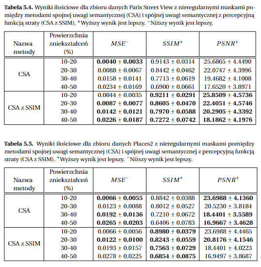

# Coherent Semantic Attention for Image Inpainting with SSIM loss

-----------
## Introduction

This repository is the practical part of a master's thesis entitled Image inpainting using artificial intelligence. 
In the experiments, an original model of a [Coherent Semantic Attention](https://github.com/KumapowerLIU/CSA-inpainting) and a model with an additional perceptual loss function were trained for the [Paris Street View](https://github.com/pathak22/context-encoder) and [Places2](http://places2.csail.mit.edu/) datasets. In addition, the distortions applied to the images were divided according to their areas occupied in the images. This allowed us to validate the reconstructed images for different ranges of missing data. The results are given below. From them, it can be seen that the method extended with the additional function SSIM achieves better qualitative and quantitative results, especially for the results of the SSIM metric, which best reflects the perceptual impression of the viewer. Thus, the combination of the reconstruction loss and the perceptual loss had the expected effect and improved the quality of the generated images.

-----------
## Results
Comparison of results for the CSA method and the CSA method with a perceptual SSIM loss function for a distortion surface of 10-20%. The images are from the Paris Street View and Places2 datasets respectively. In the upper left corner of the reconstructed images are magnifications of the sections highlighted by the black box.
<div align=center></div>
<div align=center></div>
Quantitative results for both datasets are also provided below. 
<div align=center></div>

In determining the best value of the trade-off factor between the reconstructive and perceptual loss of SSIM, it was tested whether replacing the reconstructive function entirely by the perceptual function for the underlying coherent semantic attention method would generate better quality results. Below are the results.
<div align=center></div>

-----------
## Model Architecture
<div align=center></div>

-----------
## Prerequisites
* Windows or Linux
* Python3
* Pytorch 1.0
* NVIDIA GPU + CUDA CuDNN.
* Jupyter Notebook

## Installation
* Clone this repo:
    ```
    git clone https://github.com/klaudiaplk/ImageInpainting
    cd ImageInpainting
    ```

* Install PyTorch and dependencies from http://pytorch.org

* Or you can clone the repo and run by conda
    ```
    conda env create -f environment.yaml 
    conda activate csa-inpainting
    jupyter notebook
    ```
  Open the browser and enter the URL `http://localhost:8080` to enjoy jupyter notebook


* If you prefer to use Google Colaboratory, there are files in the colaboratory folder that allow you to run your code there.
--------------

## Datasets
I use [Places2](http://places2.csail.mit.edu/) and [Paris Street-View](https://github.com/pathak22/context-encoder) datasets. To train a model on the full dataset, download datasets from official websites.

Model is trained on the irregular mask dataset provided by [Liu et al](https://arxiv.org/abs/1804.07723). You can download publically available Irregular Mask Dataset from their [website](http://masc.cs.gmu.edu/wiki/partialconv).

--------------
## Model Training
* Download your own inpainting datasets.
* Open train.ipynb in Jupyter Notebook
* Modify Option Class to set data_root,mask_root,checkpoints_dir, mask_type and other parameters.
* Run train.ipynb

--------------
## Model Testing
* Open test.ipynb in Jupyter Notebook
* Keep the same parameters as during training
* Run test.ipynb

--------------
## License
The software is for educational and academic research purpose only.

--------------
## Acknowledgments
I benefit a lot (basic CSA model) from [Coherent Semantic Attention](https://github.com/KumapowerLIU/CSA-inpainting).


